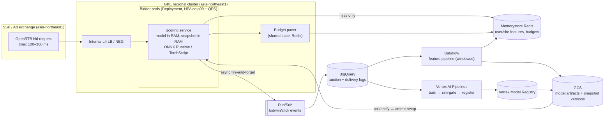

# ARCHITECTURE.md

Technical architecture of `rtb-rl` — what is implemented, why, where the honest boundaries of
the PoC are, and how the design maps onto a production GCP deployment with real RTB latency
budgets.

---

## 1. Problem framing

A publisher-side yield optimizer receives a stream of bid opportunities. For each request
`(website, placement, user)` it must, within a hard latency budget:

1. select the eligible ad with the highest expected click value,
2. suggest a bid price,
3. return the decision — typically inside an SSP's OpenRTB `tmax` of 100–300 ms end-to-end,
   which leaves single-digit milliseconds for model inference after network, auction, and
   serialization overhead.

The market is non-stationary (new campaigns, budget pacing, competitor churn), so the policy
retrains on a schedule and must handle never-seen ads and users (cold start).

### Why value-based RL over a plain CTR model or bandit

The intended justification is that **campaign budget/pacing couples successive impressions**:
showing an expensive ad now depletes budget that constrains later impressions, which makes the
problem a sequential MDP rather than independent per-impression decisions. A Q-learning
formulation with `γ > 0` can in principle learn to pace.

**Honest boundary:** in the current code, offline training uses one-step terminal transitions
(`y = r`), the budget-ratio feature is constant during training, and the Gymnasium
budget-paced environment is exercised only by tests — so the *implemented* learner is
functionally a contextual bandit with a CQL ranking regularizer. The sequential machinery
(Double-DQN bootstrap, budget-decrementing env) exists and is unit-tested, but is not yet wired
into the training loop. See §7.

## 2. Component map

```
data/synth.py          LatentClickModel (ground truth) → websites/users/ads/bid_logs (Parquet)
embeddings/            Embedder interface: local e5 | API (Vertex/OpenAI) | hashing fallback
features/
  website.py user.py   content embeddings; engagement-weighted user vectors
  affinity.py          offline top-K user↔website cosine table (Parquet)
  encode.py            THE canonical state/action feature layout (shared by all consumers)
  store.py             FeatureSnapshot (npz+json, in-process) · DurableFeatureStore (SQL)
                       · FeatureCache (Redis/memory)
rl/
  networks.py          QModel: Q(state, ad_content ⊕ learned per-ad id-embedding), dueling
  replay.py            won impressions → one-step transitions; batched candidate pools
  agent.py             Double-DQN + CQL(H) penalty; soft target updates
  cold_start.py        neighbor-borrowed id-embeddings + CTR prior; user → site-content prior
  trainer.py           training loop; warm start from registry version
sim/
  env.py               Gymnasium budget-paced auction MDP (tests only today)
  evaluate.py          expected-CTR uplift vs behavior/oracle; SNIPS secondary check
serving/
  inference.py         BidScorer: state build → batched forward → argmax → suggested bid
  app.py deps.py       FastAPI /bid; ServingState with registry-polling hot-swap
pipelines/
  build_features.py    embeddings → affinity → snapshot (+ optional SQL/Redis sinks)
  train.py             thin wrapper
  retrain_loop.py      features → warm-start train → sim gate → promote (APScheduler)
registry.py            registry/<version>/{model.pt, meta.json} + latest.json pointer
```

### Data flow (offline → online)

1. **Generate** (`rtb generate-data`): synthetic dataset with a recoverable latent click model;
   a held-out set of `is_coldstart` ads never appears in logs.
2. **Build features** (`rtb build-features`): embed website/ad text; user vector =
   engagement-weighted mean of visited-site embeddings (L2-normalized); per-(site, placement)
   market stats; everything lands in one `FeatureSnapshot`.
3. **Train** (`rtb train`): won impressions become `(state, logged_ad, reward)` transitions;
   each minibatch scores the logged ad (column 0) plus random candidate ads; loss =
   `MSE(Q_logged, y) + α · mean(logsumexp_a Q − Q_logged)` (CQL(H)). Model + meta registered.
4. **Evaluate/gate** (`rtb sim` / retrain loop): expected CTR of argmax-Q vs a random behavior
   policy and an oracle, under the shared latent model; promotion flips `latest.json`.
5. **Serve** (`rtb serve`): warm in-process snapshot + model; a background task polls the
   registry pointer every 5 s and hot-swaps. Scoring is one batched forward over candidates.

### Key design decisions

- **Ads are represented by features, not output units.** `Q(s, a_features)` with an argmax over
  a candidate set tolerates a changing inventory and makes cold-start a feature-imputation
  problem instead of an architecture change.
- **Learned per-ad id-embedding** absorbs residual appeal that content can't explain; new ads
  borrow a similarity-weighted average of neighbors' id-embeddings.
- **Won impressions only** for training labels: clicks are observable only on shown ads, so Q
  is expected click value *conditional on serving*. (The win itself is price-correlated —
  survivorship bias is acknowledged, not corrected; see §7.)
- **One snapshot to rule them out-of-process stores**: training, sim, and serving all read the
  same `FeatureSnapshot`, guaranteeing feature parity. SQL/Redis sinks exist to demonstrate the
  production shape but are write-only in the current code (§7).

## 3. Serving hot path

Per request: dict lookups into the snapshot (website vec, user vec, market stats) → numpy
assembly of `(1, M, E+6+id)` candidate tensor → single `torch.inference_mode` forward →
argmax + bid suggestion. Measured locally: p50 ≈ 0.8 ms, p99 ≈ 1.1 ms, single request,
in-process.

**Honest boundary:** the handler is `async def` but calls the CPU-bound scorer synchronously,
so concurrent requests serialize on the event loop; the quoted p99 is a zero-concurrency
number. The Redis cache is not read on this path — features come from process memory.

## 4. Cold start

- **New ad**: embed its creative text; take K=5 nearest known ads by content cosine; score with
  the similarity-weighted mean of their id-embeddings and smoothed-CTR prior; `is_cold=1` flag.
- **New / zero-engagement user**: use the current website's embedding as the user vector — an
  "assume topical alignment" prior that decays as real engagement accrues.
- CTR priors are empirical-Bayes smoothed (`(clicks + a)/(wins + a + b)`), shrinking sparse ads
  toward the global prior.

Caveats: the borrowed id-embedding can only recover appeal that correlates with content (in
the synthetic generator, residual appeal is content-independent noise by construction, so the
demo's cold-start win comes from the content features); the cold-user prior pushes the
affinity feature to 1.0, which is outside the training distribution; and the `is_cold` input is
constant 0 during training, so its weight is untrained at serving time (§7).

## 5. Retraining & promotion

Each cycle: rebuild features from logs → warm-start train from the incumbent's weights →
evaluate in the simulator → promote iff CTR uplift ≥ `retrain.uplift_gate` → serving hot-swaps
within one poll interval.

**Honest boundaries:** uplift is measured **against the random behavior policy, not the
incumbent model** — with the default gate of 0.0 every candidate promotes; there is no
champion-vs-challenger comparison yet. The `recent_window_hours` config is unused: no new logs
are ingested (serving decisions are not logged anywhere), so each cycle retrains on the same
static dataset. The drift-tracking story is architectural intent, demonstrated mechanically
(pointer flip → hot swap) but not statistically.

## 6. Evaluation methodology

- **Headline:** expected CTR (probabilities from the latent model, not sampled clicks) of the
  learned argmax policy vs. (a) uniform-random behavior and (b) the per-request oracle, over
  5 000 fresh request contexts. Low-variance and reproducible — but *self-referential*: the
  latent model that scores the policy also generated the training labels, and its signals were
  deliberately made recoverable from the features. Treat uplift as "the pipeline learns what
  was planted", not as a claim about real markets.
- **Secondary:** SNIPS off-policy estimate on logged data. Known weaknesses: the propensity is
  approximated as uniform `1/|ads|` although the logging policy was 50 % category-biased
  (mis-specified propensities bias SNIPS), and the deterministic target policy matches few
  logged actions, so the effective sample is tiny and the estimate is high-variance.
- The logged behavior policy (mildly category-biased) is *stronger* than the uniform baseline
  used in the uplift table, so "uplift vs behavior" is slightly flattered.

## 7. Known gaps (ranked)

These are deliberate PoC boundaries or known defects, kept visible on purpose:

1. **Config env-override precedence is inverted** — YAML values (passed as init kwargs) beat
   `RTB__*` env vars, so documented overrides are silently ignored for any field set in
   `config.yaml`. Downstream effect: docker-compose's Postgres/Redis backends never activate.
2. **Model/snapshot version skew on hot-swap** — `BidScorer.__init__` now validates that
   `ModelMeta.ad_ids` equals `snapshot.ad_ids` (same ids, same order) and raises on mismatch,
   so a stale-snapshot hot-swap fails loudly instead of silently misaligning positional
   id-embedding rows. `ServingState.load()` still reuses the cached snapshot between hot-swap
   polls, so an inventory-changing retrain that isn't followed by a fresh `load()` will surface
   as that validation error rather than auto-refreshing.
3. **The sequential-RL machinery is unused in training** — no env rollouts, no bootstrap
   targets, constant budget feature; γ, Double-DQN, and the dueling value head are effectively
   dormant. Related: the dueling head's advantage-mean centering makes absolute Q values
   candidate-set-dependent (ranking within a pool is unaffected, but the Q used for bid
   pricing shifts with pool composition).
4. **Promotion gate never scores the incumbent** (see §5).
5. **No data flywheel** — `/bid` decisions and outcomes are not logged; `recent_window_hours`
   is dead config; retraining re-fits the same data.
6. **Write-only production sinks** — Redis cache and SQL store are populated but never read;
   the sqlite-dialect upsert would not compile against Postgres.
7. **Event-loop blocking in serving** under concurrency (§3).
8. **Serving floor default bypassed** — addressed: `BidRequest.floor_price_jpy` now defaults
   to `None`, so omitting it lets `serving.default_floor_jpy` apply on the hot path; an
   explicit `0.0` is still honored as "no floor".
9. **Unvalidated candidate ids** — addressed: an unknown `candidate_ad_ids` entry now raises
   `UnknownCandidateError` in `BidScorer`, which the `/bid` handler maps to HTTP 400 (caller
   error) instead of surfacing as a 500 from a bare `KeyError`.
10. **Q is not a calibrated probability** — MSE-to-{0,1} minus cost, further depressed by CQL;
    `predicted_click_value` can exceed 1 and the `floor + cap·clip(Q,0,1)` bid rule is ad-hoc
    (a value-based bidder would bid `E[click] × value_per_click`, market-aware).
11. **Temporal leakage in features** — smoothed CTR and market stats are computed over the full
    log window, including each training row's own future.
12. **Synthetic realism** — CTRs are ~100× real-world levels; dense rewards make learning easy;
    no class-imbalance handling exists for realistic 0.1–1 % CTR regimes.

## 8. Production topology on GCP (target: low-latency GKE)

The Terraform/Vertex stubs in `infra/` sketch a Cloud Run topology. For real RTB traffic,
**Cloud Run is the wrong serving substrate** — cold starts, per-request CPU throttling, no
control over placement, and connection churn to Memorystore all fight a single-digit-ms
budget. The recommended production shape is GKE, co-located with the exchange:



### Latency budget (target p99 ≤ 10 ms inside the pod)

| Segment | Budget |
|---|---|
| LB + TLS + deserialization | 1–2 ms |
| Feature assembly (RAM; Redis only on miss) | ≤ 1 ms |
| Model forward (batched candidates, compiled runtime) | 2–4 ms |
| Bid logic + serialization | ≤ 1 ms |
| Headroom | 2–3 ms |

### Design choices and how the PoC maps

| Concern | PoC today | GKE production |
|---|---|---|
| Serving runtime | FastAPI + eager PyTorch | Export to ONNX/TorchScript; serve from a compiled runtime (ONNX Runtime in-process, or Go/Rust bidder calling it). Python + GIL + event-loop blocking do not survive real QPS. |
| Features | One in-process snapshot | Same warm-RAM principle per pod, but *versioned snapshots in GCS* refreshed by Dataflow; Memorystore for the long tail (users too numerous for RAM) with request-scoped timeouts and stale-on-miss fallback. |
| Model rollout | Poll `latest.json` on local disk | Versioned artifacts in GCS + Vertex Model Registry; pods watch (GCS notification → Pub/Sub) and atomically swap model+snapshot *as a pair* to avoid the skew in gap #2. Canary a % of traffic before full promote. |
| Retrain gate | Sim uplift vs random | Champion/challenger: evaluate candidate *and* incumbent on the same eval set; require candidate ≥ incumbent + margin. Add online guardrails: shadow scoring, then small-traffic A/B with auto-rollback on CTR/spend anomaly. |
| Data flywheel | None (static synthetic logs) | Log every bid/win/click to Pub/Sub → BigQuery; Dataflow builds point-in-time-correct features (no future leakage) over `recent_window_hours`; Vertex Pipelines schedule triggers retrain. |
| Budget pacing | Constant feature | Real-time pacer service with budget counters in Redis (atomic decrements), exposing remaining-budget features to the scorer — this is also what would finally justify the sequential-RL formulation. |
| Cold start | Neighbor borrowing in-process | Same algorithm as a feature service: new-creative embeddings computed at campaign onboarding (Vertex embedding API), neighbors precomputed into Redis. |
| Autoscaling | — | HPA on QPS + p99; min replicas sized for traffic floor; regional cluster with pod topology spread; no scale-to-zero. |
| Security | None (PoC) | Workload Identity, internal-only LB, mTLS from exchange, Secret Manager for DSNs, private-IP Cloud SQL/Memorystore, admin endpoints behind IAP. |

### Why not Cloud Run (kept for reference)

Cloud Run remains fine for the *control plane* (admin/reporting APIs) and for a low-QPS pilot.
The stubs' gaps if pursued anyway: a Serverless VPC Access connector is required to reach
Memorystore; there is no shared filesystem, so the file-based registry must become GCS; and
min-instances + CPU-always-allocated are mandatory to avoid cold starts on the bid path.

## 9. Scale honesty

The snapshot approach (all users/sites/ads in RAM) works because the synthetic world is tiny.
At real scale (10⁸ users), user vectors move to Memorystore/Bigtable with an in-pod LRU cache,
site/ad tables stay in RAM (small), and the affinity top-K table becomes a precomputed
Redis/Bigtable lookup — the code's `FeatureCache` interface is the intended seam, currently
unexercised on the read path.
