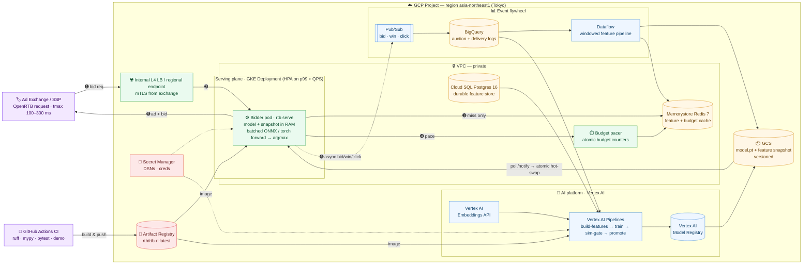
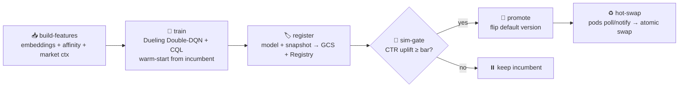
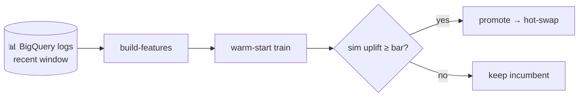
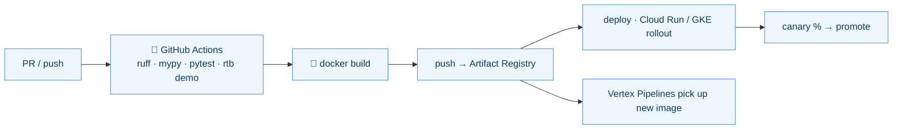

# CLOUD_ARCHITECTURE.md

`rtb-rl` on GCP — how the platform **serves the best ad in under 10 ms**, **retrains itself as the
market moves**, and **ships safely through CI/CD**. Region: **`asia-northeast1` (Tokyo)**,
co-located with the ad exchange.

---

## 1. At a glance

- ⚡ **Fast** — model + features stay warm in RAM; one batched forward pass per bid → **p99 ≤ 10 ms** in-pod.
- 💰 **Profitable** — picks the ad with the highest expected click value and bids by value.
- ♻️ **Self-adapting** — **Vertex AI Pipelines** retrains every *N* hours; a sim gate promotes only winners; pods **hot-swap** with no restart.
- ❄️ **Robust** — brand-new ads/users are scored from embedding-space neighbors, no history needed.
- 🚀 **Shippable** — GitHub Actions CI → Artifact Registry image → Cloud Run / GKE rollout.

---

## 2. Cloud architecture



**Three planes, one image:**

- 🟢 **Serving** — exchange → LB → warm bidder pod → response.
- 🔵 **AI platform** — Vertex trains, gates, and registers models; pods hot-swap.
- 🔴 **Build** — CI produces one container image that runs both serving and training.

---

## 3. GCP components

| Component | Service | Role |
|---|---|---|
| 🌐 Ingress | Internal L4 LB / regional endpoint | Terminate mTLS from the exchange, route to pods |
| ⚙️ Serving | **GKE** Deployment (Cloud Run for pilots) | Stateless bidder pods, model in RAM, HPA on p99 + QPS |
| ⏱️ Pacing | Budget pacer + **Memorystore Redis** | Atomic budget counters shared across pods |
| ⚡ Cache | **Memorystore Redis 7** | Feature + budget hot cache (read on RAM miss) |
| 🗄️ Feature store | **Cloud SQL Postgres 16** | Durable source-of-truth features |
| 🧠 Training | **Vertex AI Pipelines** + custom jobs | `build-features → train → sim-gate → promote` |
| 🏷️ Model registry | **Vertex AI Model Registry** + **GCS** | Versioned, promotable checkpoints + snapshots |
| ✍️ Embeddings | **Vertex AI Embeddings API** | Vectorize creatives / site text |
| 📨 Events | **Pub/Sub → BigQuery → Dataflow** | Log bids/wins/clicks; rebuild windowed features |
| 🐳 Images | **Artifact Registry** | `rtb/rtb-rl:latest` for serving + training |
| 🔑 Secrets / auth | **Secret Manager** + **Workload Identity** | DSNs, creds; keyless pod → GCP auth |

---

## 4. Serving fast

**Per-request hot path** (all in-process, sub-millisecond):

1. 🔎 Dict lookups into the warm in-RAM **feature snapshot** — site vector, user vector, market stats.
2. 🧱 Assemble the candidate tensor over the eligible ad set.
3. ➡️ **One batched forward pass** (ONNX Runtime / TorchScript) → a score per candidate ad.
4. 🏆 `argmax` → chosen ad → **value-based bid** clamped to `[floor, bid_cap]`.

**Latency budget — target p99 ≤ 10 ms in-pod:**

| Segment | Budget |
|---|---|
| LB + TLS + deserialization | 1–2 ms |
| Feature assembly (RAM; Redis only on miss) | ≤ 1 ms |
| Model forward (batched candidates, compiled runtime) | 2–4 ms |
| Bid logic + serialization | ≤ 1 ms |
| Headroom | 2–3 ms |

**Design rules:**

- 🧠 Everything hot lives in **pod RAM**; Redis is touched **only on a cache miss**.
- 🔁 Model **and** snapshot are swapped **atomically as a pair** — zero-downtime, no restart.
- 🏎️ Serve from a **compiled runtime** (ONNX / TorchScript), not eager Python, for real QPS.
- 📍 **Co-located** with the exchange; **HPA on p99 + QPS**, min replicas for the traffic floor, **no scale-to-zero**.

---

## 5. AI platform — model lifecycle

A model is an artifact with a lifecycle, not a file you copy once:



| Stage | What happens |
|---|---|
| 📥 **build-features** | Embed creatives/sites → user↔site affinity → market context → versioned snapshot |
| 🎯 **train** | Offline **Dueling Double-DQN + CQL**, warm-started from the current production weights |
| 🏷️ **register** | Self-describing checkpoint (architecture + ad-id ordering) → GCS + Model Registry |
| 🧪 **sim-gate** | Evaluate CTR uplift in the offline simulator |
| 🚀 **promote** | Flip the registry's default version |
| ♻️ **hot-swap** | Pods watch the pointer (GCS notify / poll) and swap model + snapshot live |

**Embeddings providers** (pluggable, all deterministic + L2-normalized):

| Provider | Backend | Use |
|---|---|---|
| `api` | **Vertex AI Embeddings** | Production — managed, multilingual (JP) |
| `local` | `multilingual-e5` (LangChain/HF) | Offline dev with semantic quality |
| `hashing` | char-n-gram | Zero-dependency CI / demo |

---

## 6. How it makes money

- 🎯 **Objective:** maximize publisher **yield** — per impression, serve the ad with the highest expected click value.
- 🧮 **Scoring:** `Q(state, ad_features)`; the server **argmaxes over the eligible ad set**, so inventory can change freely.
- 💴 **Bidding:** lean toward the campaign's `bid_cap` as predicted value rises, never below the floor.
- 🛡️ **Safety:** the **CQL** penalty stops the offline-learned policy over-valuing rarely-logged actions.
- ✅ **Guardrail:** a retrained model reaches traffic **only if it clears the sim uplift gate**; canary a slice of traffic, auto-rollback on CTR/spend anomalies.
- ❄️ **Cold-start earns from request one:** a new ad borrows a similarity-weighted blend of its content-neighbors' id-embeddings + a smoothed-CTR prior.

---

## 7. Continuous training

Every *N* hours, a **Vertex AI Pipelines Schedule** runs the retrain DAG on fresh logs:



- 📥 **Fresh data** — bids/wins/clicks flow Pub/Sub → BigQuery; Dataflow rebuilds **leakage-free windowed features**.
- 🔥 **Warm start** — each cycle fine-tunes from the incumbent, so the policy tracks market drift (new campaigns, budget/pacing shifts).
- 🧪 **Gated promotion** — champion vs. challenger on the same eval set; ship only on a margin.
- ♻️ **Live rollout** — promotion flips the pointer; pods hot-swap within one poll.

---

## 8. CI/CD



**CI gate (every push + PR, Python 3.12):**

| Step | Command |
|---|---|
| Lint | `ruff check src tests scripts` |
| Types | `mypy src` |
| Tests | `pytest -q` (offline, seed-pinned) |
| Smoke | `rtb demo` (full pipeline end-to-end) |

**Two independent delivery pipelines:**

- 🧑‍💻 **Code CD** — image → Artifact Registry → Cloud Run / GKE rollout (canary → promote).
- 🤖 **Model CD** — Vertex Pipelines → Model Registry → GCS → pointer flip → hot-swap.

They meet only at the **one container image** the Vertex components run.

---

## 9. Config, secrets & security

| Concern | Mechanism |
|---|---|
| App config | `configs/config.yaml` + `RTB__SECTION__FIELD` env overrides |
| DSNs / URLs | **Secret Manager** → injected at deploy |
| Pod → GCP auth | **Workload Identity** (no key files) |
| Model artifacts | **GCS** + Vertex Model Registry |
| Network | Internal-only LB, **mTLS** from exchange, **private IP** for Cloud SQL + Memorystore |
| Admin endpoints | Behind **IAP** |
| IAM | Least-privilege service accounts for serving vs. training |

---

## 10. Deploy

```bash
# 1. Build & push the image
gcloud auth configure-docker asia-northeast1-docker.pkg.dev
docker build -t asia-northeast1-docker.pkg.dev/PROJECT/rtb/rtb-rl:latest .
docker push  asia-northeast1-docker.pkg.dev/PROJECT/rtb/rtb-rl:latest

# 2. Provision infra
cd infra/terraform
terraform init
terraform apply -var project_id=PROJECT \
  -var image=asia-northeast1-docker.pkg.dev/PROJECT/rtb/rtb-rl:latest

# 3. Schedule the Vertex retrain pipeline (every retrain.interval_hours)
python -c "from kfp import compiler; import infra.vertex.pipeline as p; \
           compiler.Compiler().compile(p.retrain_pipeline, 'retrain_pipeline.json')"
# submit via google-cloud-aiplatform + a Vertex Pipelines Schedule
```

**Run the same topology locally:**

```bash
docker compose up --build       # Postgres + Redis + API + retrainer + bootstrap
curl -s localhost:8000/healthz
curl -s -X POST localhost:8000/bid -H 'content-type: application/json' \
  -d '{"request_id":"r1","website_id":"w0000","placement":"header","user_id":"u000000"}'
```

---

**See also:** [ARCHITECTURE.md](ARCHITECTURE.md) (ML design) · [README.md](README.md) (quickstart) ·
[infra/terraform/](infra/terraform) · [infra/vertex/pipeline.py](infra/vertex/pipeline.py).
