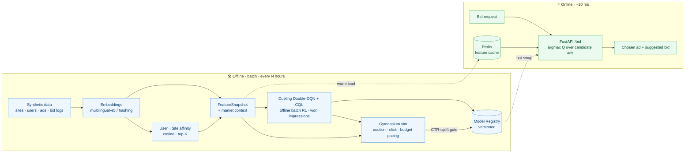

<div align="center">

# 📈 rtb-rl

*Because RL doesn't need to be the unpopular guy at the classroom.*

***Deep reinforcement learning for real-time ad bidding.*** *Picks the ad most likely to be clicked, in under 10 ms, and retrains itself as the market moves.*


</div>

---

## 🚀 Highlights

- 🎯 **Picks the highest-click-probability ad** per bid request — Dueling **Double-DQN + CQL** over website, user and auction features.
- ⚡ **~10 ms serving** — warm in-memory model + Redis feature cache, single batched matmul (`p99 ≈ 1 ms` locally).
- ♻️ **Self-adapting** — retrains every *N* hours and **hot-swaps** the model when a new one beats the incumbent in simulation.
- ❄️ **Solves cold-start** — brand-new ads/users are scored from their nearest neighbors in embedding space, no history required.
- 🧩 **Runs with zero setup** — synthetic data + a deterministic offline embedder mean `rtb demo` works with no data, no keys, no services.
- 🏢 **Production-shaped** — FastAPI · Redis · PostgreSQL · Docker Compose · Vertex AI + Terraform stubs · GitHub Actions CI.

---

## 📖 Overview

`rtb-rl` is a reconstruction of a real-time-bidding (RTB) yield-optimization PoC built at a
Japanese ad-tech company. For every incoming bid opportunity it selects the advertisement with
the **highest probability of getting a click** — using the website's context, the user's
engagement profile, and historical auction logs — suggests a bid, and serves the decision
under a low-latency SLA. The policy **retrains on a schedule** to track market drift (new
competitor campaigns, budget/pacing changes) and degrades gracefully for **never-seen ads and
users**.

Everything is driven by **synthetic data** generated from a known latent click model that the
offline simulator reuses as ground truth, so the entire pipeline — embeddings → affinity →
DQN training → simulation → serving → retraining — runs locally end-to-end.

> 🇯🇵 深層強化学習による低遅延RTB（リアルタイム入札）最適化エンジン。ウェブサイト・ユーザー・過去の入札ログから
> **クリック率が最も高い広告**を選び、10ms以内で配信。市場の変化に追従するためN時間ごとに再学習し、
> 新規広告・ユーザーのコールドスタート問題にも対応します。

---

## 🧱 Tech stack

| Layer | Tools |
|---|---|
| **ML / RL** | PyTorch 2 · Gymnasium · Conservative Q-Learning (offline RL) · scikit-learn (kNN) |
| **Embeddings** | LangChain + `multilingual-e5` · deterministic hashing fallback |
| **Serving** | FastAPI · Uvicorn · Pydantic v2 · Typer (CLI) |
| **Data / state** | Polars + Parquet · Redis (hot cache) · PostgreSQL / SQLAlchemy (feature store) |
| **Orchestration** | APScheduler · Docker Compose · Vertex AI Pipelines *(stub)* · Terraform *(stub)* |
| **Tooling** | Poetry · Ruff · Mypy · Pytest · GitHub Actions |

---

## 🗺️ Architecture



### 🧠 Design decisions

- **DQN over *ad features*, not a fixed action head.** The network scores `Q(state, ad_features)`
  and the server argmaxes over eligible ads. Representing an ad by its features/embeddings
  (rather than a per-ad output unit) is what makes a variable inventory and cold-start tractable.
- **Click-probability objective.** Training uses **won impressions only** (a click is observable
  only when the ad was shown), so `Q(s,a)` learns expected click value *given the ad is served*.
- **Conservative offline RL.** A **CQL** penalty stops the model overvaluing actions absent from
  the logs — the key correction when learning a policy from logged bids you can't safely explore.
- **Why RL, not a bandit.** Campaign **budget/pacing** is part of the state, coupling successive
  impressions into an episode; the Gymnasium simulator provides that sequential MDP for tuning.
- **Cold-start by borrowing.** A learned per-ad id-embedding captures residual appeal; a new ad
  borrows a similarity-weighted blend of its content-neighbors' id-embeddings + CTR prior.
- **10 ms serving.** Features come from a warm in-process snapshot (no Postgres on the hot path),
  the model stays in memory, scoring is one batched `torch.inference_mode` matmul.

---

## 📊 Results

From `rtb demo` (hashing embedder, seed 42): 60 sites · 2,000 users · 112 ads · 50k bid logs.

| Metric | Value |
|---|---|
| Behavior policy CTR (logging policy, random) | **13.30 %** |
| **Learned policy CTR** (DQN argmax) | **40.02 %** |
| Oracle ceiling CTR (best ad in pool) | 52.49 % |
| **CTR uplift vs behavior** | **+200.9 %** |
| Oracle gap closed | 68.2 % |
| Cold-start ad (no history) rank on a matching site | **#2 / 41** |
| Serving latency (CPU, in-process) | `p50 0.77 ms` · `p99 1.14 ms` |

---

## ⚡ Installation

Requires **Python 3.12** (PyTorch has no 3.13/3.14 wheels yet). No GPU or network needed.

### With Poetry (recommended)

```bash
poetry install                      # core deps (CPU torch from the pytorch-cpu source)
poetry install --extras embeddings  # + real multilingual-e5 embeddings (optional)
poetry run rtb demo                 # full pipeline end-to-end
```

### With pip

```bash
py -3.12 -m venv .venv && .venv\Scripts\activate     # *nix: python3.12 -m venv .venv && source .venv/bin/activate
pip install torch --index-url https://download.pytorch.org/whl/cpu
pip install -e ".[dev]"
rtb demo
```

---

## 🖥️ Commands

| Command | What it does |
|---|---|
| `rtb demo` | **Run everything**: generate data → build features → train → evaluate, and print the CTR-uplift table |
| `rtb generate-data` | Synthesize websites / users / ads / bid logs → `data/raw/` |
| `rtb build-features` | Embeddings + user↔site affinity + market context → `data/processed/` |
| `rtb train` | Train the offline Dueling Double-DQN + CQL and register the model → `registry/` |
| `rtb sim` | Evaluate the latest model in the simulator (CTR uplift vs behavior & oracle) |
| `rtb serve` | Start the FastAPI bidding service on `:8000` |
| `rtb retrain --once` | Run one retrain cycle (warm-start → sim-gate → promote) |
| `rtb retrain` | Run the continuous loop every `retrain.interval_hours` (APScheduler) |

> Prefix with `poetry run` when using Poetry (e.g. `poetry run rtb serve`). Equivalent `make`
> targets (`make demo`, `make train`, …) and `scripts/*.py` wrappers are also provided.

### Score a bid

```bash
rtb serve
curl -s -X POST localhost:8000/bid -H 'content-type: application/json' \
  -d '{"request_id":"r1","website_id":"w0000","placement":"header","user_id":"u000001"}'
# → {"ad_id":"ad011","bid_price_jpy":155.2,"predicted_click_value":1.21,"model_version":"v…","latency_ms":0.8}
```

---

## ⚙️ Configuration

All settings live in [`configs/config.yaml`](configs/config.yaml); every field is overridable by
environment variable `RTB__SECTION__FIELD`. Secrets come from the environment — see
[`.env.example`](.env.example).

| Setting | Default | Meaning |
|---|---|---|
| `embeddings.provider` | `local` | `local` (e5) · `api` (Vertex/OpenAI) · `hashing` (offline fallback) |
| `store.feature_backend` | `memory` | durable store: `memory` · `sqlite` · `postgres` |
| `store.cache_backend` | `memory` | hot cache: `memory` · `redis` |
| `rl.cql_alpha` | `1.0` | strength of the Conservative Q-Learning penalty |
| `rl.gamma` | `0.85` | discount (sequential budget pacing) |
| `retrain.interval_hours` | `6` | retrain cadence |
| `retrain.uplift_gate` | `0.0` | promote a new model only if sim CTR-uplift ≥ this |

### Embedding providers

| Provider | `embeddings.provider` | Needs | Notes |
|---|---|---|---|
| **Hashing** | `hashing` | nothing | Deterministic char-n-gram fallback; default-on when the local model is unavailable. Used in CI/demo. |
| **Local** | `local` | `--extras embeddings` | `multilingual-e5` via LangChain; best semantic quality for Japanese. |
| **API** | `api` | credentials | Vertex AI or OpenAI embeddings via LangChain. |

---

## 🐳 Docker & production path

`docker compose up --build` brings up **Postgres** (durable feature store) + **Redis** (hot
cache) + the **API** + a **retrainer**; a one-shot `bootstrap` service seeds data/features/model.

```bash
docker compose up --build
curl -s localhost:8000/healthz
```

[`infra/terraform/`](infra/terraform) (Cloud Run + Memorystore + Cloud SQL) and
[`infra/vertex/pipeline.py`](infra/vertex/pipeline.py) (Vertex AI Pipelines DAG) document the GCP
topology as reviewed stubs — the every-*N*-hours retrain DAG maps 1:1 onto a Vertex Pipelines schedule.

---

## 🧪 Testing & quality

```bash
poetry run pytest -q          # 17 tests, fully offline (~8s)
poetry run ruff check src tests scripts
poetry run mypy src
```

CI ([`.github/workflows/ci.yml`](.github/workflows/ci.yml)) runs lint + types + tests + an
end-to-end `rtb demo` smoke test on Python 3.12.

---

## 📂 Project layout

```
src/rtb_rl/
  config.py schemas.py registry.py cli.py
  data/        synth.py (latent click model) · loaders.py (parquet)
  embeddings/  base · local (e5) · api · hashing · factory
  features/    website · user · affinity (offline top-K) · encode · store (snapshot/SQL/Redis)
  rl/          networks (dueling) · replay · agent (Double-DQN + CQL) · trainer · cold_start
  sim/         env (Gymnasium, budget-paced) · evaluate (CTR uplift + SNIPS)
  serving/     app (FastAPI) · inference (BidScorer) · deps (hot-swap) · cache
  pipelines/   build_features · train · retrain_loop
tests/  infra/  configs/  scripts/  Dockerfile  docker-compose.yml
```

---

## ⚠️ Limitations

- Synthetic data is generated from a known click model that is also the simulator's ground
  truth, so reported uplift is a sanity signal, not a production claim.
- Offline log training is one-step (independent impressions); the sequential `gamma>0` path is
  exercised via the simulator. SNIPS is a coarse, high-variance off-policy check.
- The hashing embedder is purely lexical — install the `embeddings` extra for semantic quality.

---

## 📜 License

Apache-2.0 — see [`LICENSE`](LICENSE).

<div align="center">

Built as a portfolio reconstruction of a Japanese ad-tech RTB PoC. ☕

</div>
